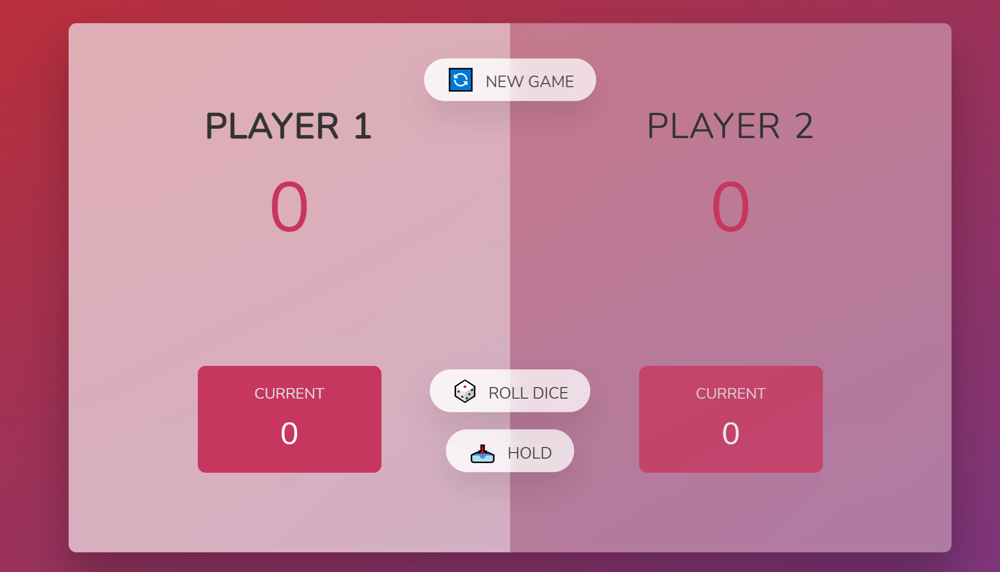

# Dice-Roll

This project is about a rolling dice game, there're 2 players in this game, each time the active player can choose either rolling dice or holding the current number, by "rolling 
dice", the player will be able to accumulate the dice points of each roll while taking the risk of the case that once the dice is rolled as 1, then the active player will lose all of the points 
of the current round and it directly skips to the next player, player who wins 20 points at first wins the victory of the game. The project is implemented by HTML5, CSS3, JavaScript and 
DOM API, HTML5 and CSS5 templates are given by the Udemy instructor Jonas Schmedtmann.

### Initialization 

### Flowchart

